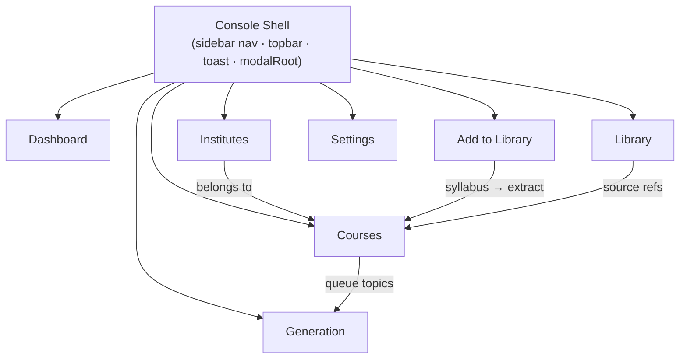
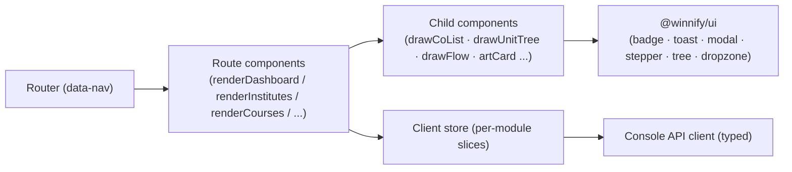
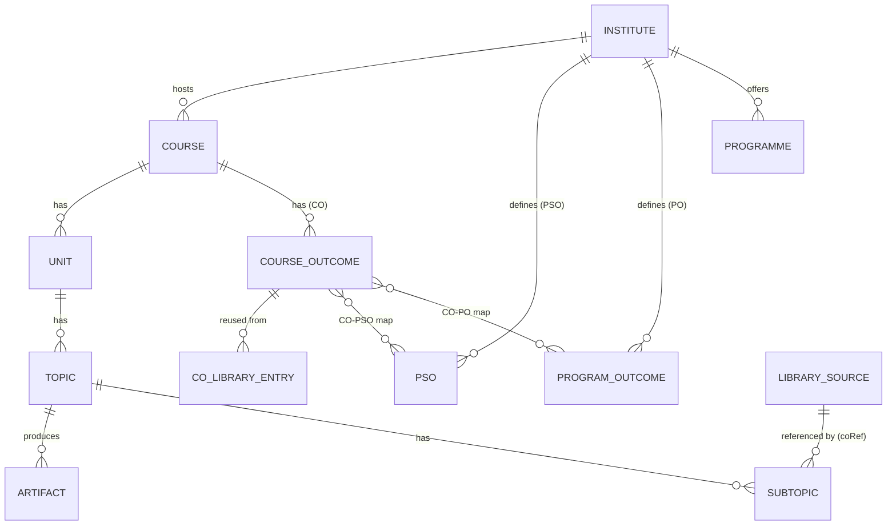
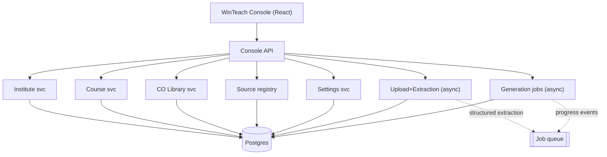

## 1. Scope 

| Nav group | `data-nav`   | Module                                                            | Render entry point(s)                                                                                                                                  |
| --------- | ------------ | ----------------------------------------------------------------- | ------------------------------------------------------------------------------------------------------------------------------------------------------ |
| Workspace | `dashboard`  | **Dashboard**                                                     | nav counts: `navInstCount`, `navCourseCount`, `navGenCount`, `navAddCount`                                                                             |
| Workspace | `institutes` | **Institutes** (Programs, POs, PSOs, Accreditation)               | `renderInstitutes`, `renderInstituteDetail`, `instituteCard`, `openInstituteEditor`, `psoRow`, `po`/`pso`                                              |
| Workspace | `courses`    | **Courses** (create wizard, detail, outcomes, structure, mapping) | `renderCourses`, `renderCreate`, `renderCoursePage`, `renderTopicPage`, `createStep1/2/3`, `drawCoList`, `drawCoSuggest`, `coMapTable`, `drawUnitTree` |
| Workspace | `generation` | **Generation** (artifact jobs)                                    | `renderGeneration`, `drawFlow`, `runTopicFlow`, `startParallel`, `artCard`, `statusBadge`                                                              |
| Workspace | `library`    | **Library** (source catalog)                                      | `library` views, `coRefFor`                                                                                                                            |
| Workspace | `addlib`     | **Add to Library** (upload → extract)                             | `renderAddLibrary`, `drawUpload`, `extract`, `drawExtract`, `drawDelta`                                                                                |
| Account   | `settings`   | **Settings / Account**                                            | settings view                                                                                                                                          |

**Explicitly out of scope** (not in the HTML): student/faculty/HOD delivery screens, Qdrant hybrid-search internals, the 9 quality guards, Path B elicitation, human review queues, symbolic-math validation. The HTML models a **reduced 4-artifact set**.



---

## 2. Console Shell (cross-module)

Every module renders inside one shell, taken directly from the prototype:

- **Sidebar** (`.sidebar`, `.brand`, `.nav`, `.nav-item[data-nav]`, `.nav-label`) with live count pills (`navInstCount`, `navCourseCount`, `navGenCount`, `navAddCount`).
- **Topbar** (`.topbar`, `#pageTitle`, `#topActions` / `.page-actions`).
- **Toast** system (`toastRoot`, `toast()`), **modal root** (`modalRoot`), status badges (`statusBadge`, `topicBadge`, `.badge.b-green/.b-info/.b-orange`, `.dot`).
- Client-side router replacing `setNav` / `go`: `data-nav` → route.

**Port target:** `apps/winteach-console`. Shell + badges + toast + modal become shared primitives in `@winnify/ui`. Each `render*` function → a route component; each `draw*` helper → a child component.



---

## 3. Shared Data Model (scoped to the prototype's entities)

The HTML's seed objects define the entity graph. This is the **only** data the Console modules touch.




| Entity                      | Prototype shape (observed)                                                  | Notes                                                             |
| --------------------------- | --------------------------------------------------------------------------- | ----------------------------------------------------------------- |
| **Institute**               | `{name, short, type, location, regulation, accreditation, pos:[], psos:[]}` | Owns POs and PSOs.                                                |
| **Programme**               | `program` field (e.g. `B.Tech CSE`), `major` (e.g. `CSE`)                   | Lightweight on course; institute holds the catalog.               |
| **Program Outcome (PO)**    | `{code:'PO'+n, text}`                                                       | Institute-level.                                                  |
| **PSO**                     | `{code:'PSO'+n, text, scope:'common''major', major}                         |                                                                   |
| **Course**                  | `{code, name, institute, program, major, sem, credits, regulation, units}`  | Unit of work; created via 3-step wizard.                          |
| **Course Outcome (CO)**     | `{code, text, bloom, ...}` + mapping to PO/PSO                              | Extracted from syllabus, editable, or pulled from **CO Library**. |
| **CO Library entry**        | suggestion pool (`drawCoSuggest`, `coRefFor`)                               | `add from existing` reuse path.                                   |
| **Unit / Topic / Subtopic** | `units:[{... topics:[{... subs:[]}]}]`                                      | Tree; topic carries Bloom + CO + subtopics + artifacts.           |
| **Artifact**                | `artifacts:{notes, preassess, quiz, flash}` (0–100 progress)                | **Only 4 types** in the prototype.                                |
| **Library Source**          | book/source catalog entry                                                   | Referenced by subtopics.                                          |
**Status / progress vocabulary in the prototype:** topic states `draft → generating → ready/done`; institute/course `status: draft|active`; artifact progress `0–100` with `notes>=100` gating the parallel three.

---

## 4. Per-Module Architecture

### 4.1 Dashboard (`dashboard`)
- **Screens:** workspace home with the four counts (institutes, courses, in-generation, additions) and entry CTAs ("Upload a syllabus to generate your first course plan").
- **Components:** count cards, recent-courses list, empty states.
- **State:** derived/aggregate — no writes.
- **API:** `GET /dashboard/summary` → `{instituteCount, courseCount, generatingCount, recentAdditions[]}`.
- **Backend slice:** read-only aggregation over Institute/Course/Generation tables.

### 4.2 Institutes (`institutes`)
- **Screens:** institute list (`renderInstitutes`, `instituteCard`), institute detail (`renderInstituteDetail`) with **Programs**, **Program Outcomes (PO)**, **PSOs** (scope: common/major), **Accreditation**; create/edit modal (`openInstituteEditor`, `openOutcomeEditor`).
- **Components:** institute card, PO list, PSO rows (`psoRow` with scope toggle), accreditation fields.
- **State:** `institutes[]` slice with nested `pos[]`, `psos[]`.
- **API:** `GET/POST/PATCH /institutes`, `…/institutes/{id}/pos`, `…/institutes/{id}/psos`.
- **Backend slice:** Institute CRUD; POs/PSOs as child collections. No AI.

### 4.3 Courses (`courses`) — the largest module
Sub-flows, each a real screen:

**a) Course list** (`renderCourses`) — cards with completion % (`coursePct`), status badge, filtered by institute (`coursesForInstitute`).

**b) Create wizard** (`renderCreate`, `createStep1/2/3`, `stepper`) — 3 steps:
1. Course info (`f_code, f_name, f_inst, f_prog, f_major, f_sem, f_cr, f_reg`) — or upload syllabus (→ Add to Library / extract).
2. Review extracted **Course Outcomes** (`drawCoList`, `drawCoSuggest`, `openCoEditor`, `editCo`, `renumberCos`, `finalizeCoStep`): add / edit / delete COs, pull from **CO Library**, then Topics + CO–PO/PSO mapping + Bloom tags generate from the final CO set.
3. Finalize (`prepFinalize`, `finalize`, `buildCourseFromDraft`) → course becomes `active`.

**c) Course detail** (`renderCoursePage`) — outcomes summary (`coSummary`, `coListSummary`), CO–PO/PSO map (`coMapTable`, `mapCols`, `ensureMapping`), unit/topic tree (`drawUnitTree`), per-topic completion (`topicPct`).

**d) Topic page** (`renderTopicPage`, `openTopicEditor`) — topic identity, Bloom (`mt_bloom`), linked CO (`mt_co`), subtopics (`mt_subs`), artifact status, **Generate** entry.

- **State:** `courses[]`, plus a transient `draft` during the wizard.
- **API:** `POST /courses` (from draft), `GET /courses/{id}`, `POST /courses/{id}/cos`, `POST /courses/{id}/co-map`, `GET/POST /co-library/suggestions`, `POST /courses/{id}/structure/lock`.
- **Backend slice:** Course CRUD; CO management + CO Library reuse; CO↔PO/PSO mapping; curriculum tree persistence. Syllabus-driven CO/topic generation is delegated to the **Add-to-Library extraction** slice (§4.5).

### 4.4 Library (`library`)
- **Screens:** catalog of sources/books referenced by courses; `coRefFor` resolves which source backs a subtopic.
- **Components:** source cards, coverage/reference badges.
- **State:** `library[]` slice.
- **API:** `GET /library`, `GET /library/{id}`, `GET /library/{id}/references`.
- **Backend slice:** source registry + subtopic→source reference index. (Deep ingestion-quality probes are canonical-pipeline scope, not shown here.)

### 4.5 Add to Library (`addlib`)
- **Screens:** upload zone (`drawUpload`, dropzone `dz`, "Drop a PDF or image, or browse" / "Upload syllabus"), processing → **extraction review** (`extract`, `drawExtract`, `drawExtractAddTopics`), **delta** view (`drawDelta`, `updDelta`) of what changed.
- **Components:** dropzone, processing indicator, extracted-COs/topics editor, delta list.
- **State:** upload session + extraction result (COs, topics, subtopics, mappings) before commit.
- **API:** `POST /uploads` (file) → `GET /uploads/{id}/extraction` (poll) → `POST /uploads/{id}/commit` (apply COs/topics to a course).
- **Backend slice:** file intake + an **extraction service** (the one real async step in the Console) returning structured COs/topics/subtopics with confidence. This is the seam to the canonical Stage 0; here it only needs to return the structured record the review UI edits.

### 4.6 Settings / Account (`settings`)
- **Screens:** account/profile, regulation defaults, theme (`data-theme`).
- **State:** user/workspace preferences.
- **API:** `GET/PATCH /settings`.
- **Backend slice:** preferences store. No AI.

---

## 5. Front-End Architecture (React port)

```
apps/winteach-console/src/
├─ app/            # router (data-nav → routes), shell layout
├─ routes/
│  ├─ dashboard/   # renderDashboard
│  ├─ institutes/  # renderInstitutes, renderInstituteDetail, PO/PSO editors
│  ├─ courses/     # renderCourses, renderCreate (wizard), renderCoursePage, renderTopicPage
│  ├─ library/     # library catalog
│  ├─ add-library/ # renderAddLibrary (upload → extract → delta)
│  ├─ generation/  # renderGeneration (board + artCard)
│  └─ settings/
├─ components/      # drawCoList, drawUnitTree, drawFlow, coMapTable, stepper → components
├─ store/           # per-module slices (institutes, courses, library, generation, uploads)
└─ api/             # typed Console API client (from @winnify/contracts)
```

- **State management:** lightweight store (Zustand or React Query) — React Query for server state (courses, institutes, generation progress), local store for wizard `draft` and upload sessions. The prototype's single mutable `state`/`DB` object splits into typed per-module slices.
- **Live progress:** Generation board and Add-to-Library extraction subscribe to SSE/WebSocket for job/extraction progress (replacing `setInterval`).
- **Design system:** shell, badges (`b-green/b-info/b-orange`), toast, modal, stepper, tree, dropzone → `@winnify/ui`.

---

## 6. Backend Slices Required (only what these 7 modules need)

| Slice                                                    | Serves modules                | Sync/Async  | AI?                               |
| -------------------------------------------------------- | ----------------------------- | ----------- | --------------------------------- |
| **Institute service** (CRUD + PO/PSO)                    | Institutes, Courses           | Sync        | No                                |
| **Course service** (CRUD, COs, CO-map, structure)        | Courses, Dashboard            | Sync        | No                                |
| **CO Library service** (suggest/reuse)                   | Courses                       | Sync        | Yes (similarity lookup)           |
| **Upload + Extraction service**                          | Add to Library, Course create | **Async**   | Yes (syllabus parse → COs/topics) |
| **Library/Source registry**                              | Library, Courses              | Sync        | No                                |
| **Generation job service** (notes→parallel, 4 artifacts) | Generation                    | **Async**   | Yes                               |
| **Settings service**                                     | Settings                      | Sync        | No                                |
| **Dashboard aggregation**                                | Dashboard                     | Sync (read) | No                                |

Only **two slices are async/AI** (Extraction, Generation) — everything else is plain CRUD. This keeps the Console backend small: a single API service + one job runner is sufficient for the HTML's scope.



---

## 7. Build Phases (scoped to Console modules)

| Phase | Goal | Modules | Exit criteria |
|---|---|---|---|
| **C0 — Shell + CRUD** | Real app skeleton | Shell, Dashboard, Institutes, Settings | Navigate all routes; create an Institute with POs/PSOs; counts live |
| **C1 — Course modeling** | Course end-to-end without AI | Courses (wizard, detail, CO manual + library, CO-PO/PSO map, tree), Library | Create a course manually, map COs, build unit/topic tree |
| **C2 — Syllabus extraction** | The one ingestion step | Add to Library (upload → extract → delta), Course create step 2 | Upload a syllabus → review extracted COs/topics → commit to a course |
| **C3 — Generation** | The 4-artifact flow | Generation (notes→parallel, regen, genAll) | Queue a topic → Teacher Notes completes → 3 parallel artifacts complete; regenerate works |
| **C4 — Polish** | Production feel | All | Live progress via SSE; empty/error states; toast/modal parity with prototype |

---

## 8. Risks & Notes

| Item                            | Note                                                                                                                                                                    |
| ------------------------------- | ----------------------------------------------------------------------------------------------------------------------------------------------------------------------- |
| **Extraction realism**          | The HTML "extract" is mocked. C2 needs a real syllabus parser; its output contract (COs/topics/subtopics + confidence) is the integration seam to the broader pipeline. |
| **In-memory → typed slices**    | One mutable `state` object today; split into typed per-module slices to avoid coupling.                                                                                 |
| **CO–PO/PSO mapping integrity** | `ensureMapping`/`coMapTable` imply a many-to-many matrix; model it explicitly so accreditation reporting stays correct.                                                 |

---
