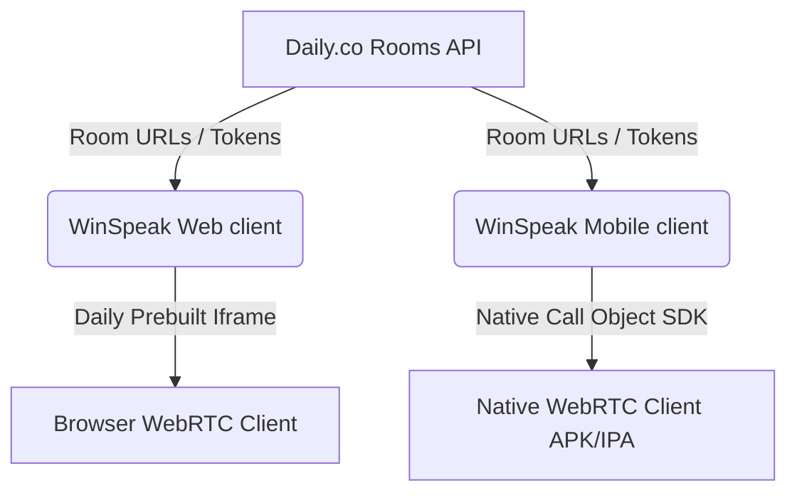

# WinSpeak Daily.co Integration Documentation
This document outlines the architecture, implementation details, build guidelines, and platform limitations of the Daily.co video calling integration for both the **Web (React/Vite)** and **Mobile (React Native/Expo)** applications in the WinSpeak project.

---

## 1. Architectural Overview

WinSpeak is designed to provide seamless, real-time audio and video communications powered by Daily.co. The system is split into two primary client applications sharing a common signaling and rooms infrastructure:



*   **Web Channel**: Utilizes Daily's **Prebuilt Iframe Integration** (`@daily-co/daily-js`) which mounts a managed, high-performance UI directly in the browser DOM.
*   **Mobile Channel**: Utilizes Daily's **Native Call Object SDK** (`@daily-co/react-native-daily-js` + WebRTC native drivers) to render video and audio natively on Android and iOS devices, ensuring the user stays entirely in-app without web wrappers or redirections.

---

## 2. Web Channel (React & Vite)

### How It is Built
*   **Core Stack**: React 19 + Vite 8
*   **Dependency**: `@daily-co/daily-js` (client library wrapper)
*   **Styling**: Pure CSS (`App.css`) for responsive grid elements and custom lobby frames.
*   **Key Files**:
    *   [App.jsx](file:///d:/Projects/winnify/daily_co/web/src/App.jsx): Dashboard shell, controls for room type selection (Demo vs. Custom Room URLs), join tokens, and error indicators.
    *   [DailyCall.jsx](file:///d:/Projects/winnify/daily_co/web/src/components/DailyCall.jsx): Custom component responsible for initializing, mounting, and managing the lifecycle of the Daily iframe.

### What is Implemented
1.  **Iframe Injection & Management**: Automatically creates or retrieves a `DailyIframe` instance and mounts it in a standard wrapper container.
2.  **Room URL & Token Support**: Connects to the default demo room (`https://demo.daily.co/hello`) or accepts custom room URL configurations and authorization join tokens for secure/private meetings.
3.  **Strict Mode Lifecycle Handling**:
    *   React 19's Strict Mode double-mounts components in development, which causes asynchronous `destroy()` calls to conflict with new `createFrame()` calls.
    *   The implementation uses `DailyIframe.getCallInstance()` to check for an existing instance and dynamically re-parent it if found.
    *   It defers `destroy()` calls on unmount by 100ms using `setTimeout()`, verifying if the iframe was actually removed from the DOM to avoid clean-up conflicts.
4.  **Meeting Event Synchronization**: Listens and responds to the iframe's native `joined-meeting`, `left-meeting`, and `error` events to coordinate React component states.

### Limitations & Caveats
*   **Secure Context (HTTPS)**: Modern web browsers strictly forbid access to camera and microphone peripherals (`navigator.mediaDevices`) over plain HTTP. The application **must** be served over `localhost` (during development) or a secure `https://` domain (for staging/production).
*   **Iframe Permission Delegation**: The iframe requires explicit browser permission delegation. The iframe container must allow camera, microphone, screen capture, and auto-play capabilities:
    ```html
    allow="camera; microphone; display-capture; autoplay"
    ```
*   **Background Throttling**: On mobile browsers (Safari on iOS, Chrome on Android), minimizing the browser tab or locking the screen causes the OS to throttle/freeze Javascript execution. This suspends the WebRTC connection, resulting in a paused video feed or disconnected audio stream.

---

## 3. Mobile Channel (React Native & Expo)

### How It is Built
*   **Core Stack**: Expo SDK 54 + React Native 0.81.3
*   **Native SDK Dependencies**:
    *   `@daily-co/react-native-daily-js` (Native Call Object wrapper)
    *   `@daily-co/react-native-webrtc` (The native C++ WebRTC library compiled for Android & iOS)
    *   `@daily-co/config-plugin-rn-daily-js` (Expo configuration plugin for native builds)
*   **Key Files**:
    *   [App.js](file:///d:/Projects/winnify/daily_co/mobile/App.js): Complete calling client implementing Native Call Objects, grids, and permissions.
    *   [app.json](file:///d:/Projects/winnify/daily_co/mobile/app.json): Expo manifest containing permissions and native plugins config.
    *   [eas.json](file:///d:/Projects/winnify/daily_co/mobile/eas.json): Expo Application Services build profiles.
    *   [.npmrc](file:///d:/Projects/winnify/daily_co/mobile/.npmrc): Global npm flag (`legacy-peer-deps=true`) to bypass package conflict checks during builds.

### What is Implemented
1.  **Fully Native Call Object API**: Bypasses the prebuilt iframe altogether. The app creates a headless call manager (`Daily.createCallObject()`) and wires the raw video tracks to local UI components.
2.  **Native Media View Rendering**: Renders real-time video tiles using `<DailyMediaView>` which links directly to native device hardware render buffers.
3.  **OS Permission Requests**: Uses React Native's `PermissionsAndroid` API at runtime to request `CAMERA` and `RECORD_AUDIO` permissions before initiating connection processes.
4.  **Local PiP (Picture-in-Picture) and Grid Layout**:
    *   Local camera feed is displayed in a floating preview tile in the top-right corner.
    *   Remote participants are dynamically rendered in a scrollable, responsive grid (`FlatList`).
5.  **Native In-Call Controls**: Custom styled buttons to toggle mic/camera states (`callObject.setLocalAudio()` / `setLocalVideo()`) and disconnect from sessions.
6.  **EAS Build Pipeline**: Configured for EAS (Expo Application Services) cloud compilation to build native Android APKs.

### Limitations & Caveats
*   **Expo Go Sandbox Incompatibility**:
    *   **Expo Go cannot run this app.** Expo Go is a pre-compiled sandbox and does not contain the native binaries for C++ WebRTC.
    *   Running the app in development requires generating a custom native build (an Android `.apk` or iOS `.ipa` client).
*   **Version Pinning & Strict Peer Dependencies**:
    *   React Native WebRTC packages are highly sensitive to the underlying React Native framework version.
    *   Expo 54 requires strict locks on specific Daily package versions (`@daily-co/react-native-daily-js` at `@0.82.0` and `@daily-co/react-native-webrtc` at `124.0.6-daily.1`). Upgrading or mismatching these will result in compile-time Gradle failures or native runtime crashes.
*   **EAS Build npm Conflicts**: Standard NPM peer-dependency checks will fail during EAS builds because Daily's packages explicitly flag peer warnings with newer Expo environments. The project uses an `.npmrc` containing `legacy-peer-deps=true` to force EAS dependency resolution.
*   **Background Audio Rules**: Real-time communication backgrounding (staying in call when minimizing the app) requires manual OS permissions setup (e.g. Android `FOREGROUND_SERVICE` declarations, iOS `UIBackgroundModes` permissions for VoIP). Without these, the operating system terminates socket and hardware device access when the app loses focus.

---

## 4. Feature Comparison: Web vs. Mobile

| Feature | Web Channel (React / Vite) | Mobile Channel (React Native / Expo) |
| :--- | :--- | :--- |
| **Integration Pattern** | Daily Prebuilt Iframe (`DailyIframe`) | Native Call Object API (`Daily.createCallObject`) |
| **Video Rendering** | HTML `<iframe>` (handled by Daily) | Native `<DailyMediaView>` component |
| **UI Customization** | Restricted to Daily Prebuilt styling configs | 100% custom UI control (React Native views) |
| **Development App** | Instant launch in browser | Requires Native Build (No Expo Go support) |
| **Platform Compatibility**| Any WebRTC compatible browser | Android (APK/AAB) & iOS (IPA/TestFlight) |
| **Permissions Prompt** | Browser permission popup | Native OS Permission Alert |

---

## 5. Development and Build Commands

### Web Project Run & Build
In the `web/` directory:
*   **Start Local Development**:
    ```bash
    npm run dev
    ```
*   **Compile Production Distribution**:
    ```bash
    npm run build
    ```

### Mobile Project Run & Build
In the `mobile/` directory:
*   **Generate Native Code Folders (Local Prebuild)**:
    ```bash
    npx expo prebuild --clean
    ```
*   **Compile and Run on Local Android Device/Emulator** (Requires Android Studio SDK tools):
    ```bash
    npx expo run:android
    ```
*   **Submit Cloud Build to Expo Services (EAS)**:
    ```bash
    npx eas-cli build --platform android --profile preview --non-interactive
    ```
